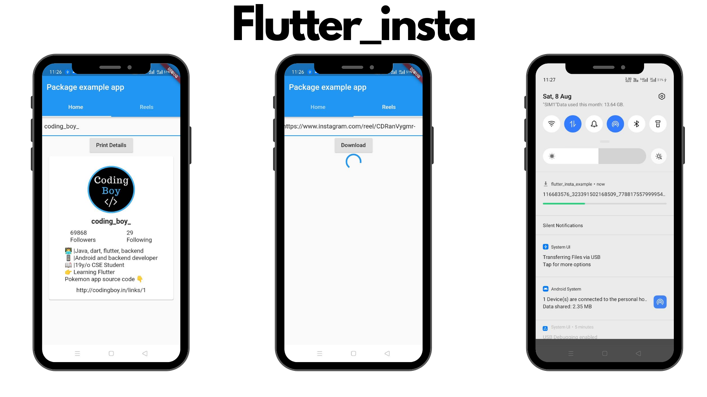

Flutter package to get Instagram user details and download reels videos.

## How to Use 

To use flutter_insta, first start by importing the package.
```dart
import 'package:flutter_insta/flutter_insta.dart';
```

### Get profile details
 
```dart
FlutterInsta flutterInsta = new FlutterInsta();
await flutterInsta.getProfileData("coding_boy_); //instagram username
```

Print Details
```dart
print("Username : ${flutterInsta.username}");
print("Followers : ${flutterInsta.followers}");
print("Folowing : ${flutterInsta.following}");
print("Bio : ${flutterInsta.bio}");
print("Website : ${flutterInsta.website}");
print("Profile Image : ${flutterInsta.imgurl}");
print("Feed images":${flutterInsta.feedImagesUrl}");
```

### Download Reels video
```dart 
String downloadLink =  await flutterInsta.downloadReels("https://www.instagram.com/reel/CDlGkdZgB2y/"); //URL
```

### Example
[Click here for more Example](https://pub.dev/packages/flutter_insta/example)


Created by [Viral Vaghela](https://www.linkedin.com/in/viralv/)
